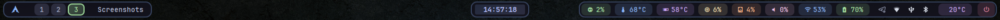

<div align="center">

# 🎨 Waybar Modern Theme

<p align="center">
  
  
  
</p>

<p align="center">
  A stunning, modern Waybar configuration featuring glassmorphism design, smooth animations, and Catppuccin-inspired colors.
</p>

<p align="center">
  <a href="#-features">Features</a> •
  <a href="#-installation">Installation</a> •
  <a href="#-modules">Modules</a> •
  <a href="#-customization">Customization</a> •
  <a href="#-credits">Credits</a>
</p>

---



</div>

## ✨ Features

- 🎨 **Modern Glassmorphism Design** - Sleek, translucent appearance with smooth borders
- 🌈 **Catppuccin Color Palette** - Beautiful, vibrant color scheme with themed module colors
- ✨ **Smooth Animations** - Fluid transitions and hover effects on all modules
- 🎯 **Dynamic Workspaces** - Only shows active workspaces with color-coded indicators
- 🌡️ **Temperature Monitoring** - Real-time CPU and GPU temperature tracking with color alerts
- ⚡ **Power Profile Control** - Switch between performance, balanced, and power-saver modes on the fly
- 📱 **Responsive Layout** - Compact design that maximizes screen real estate
- 🔧 **Custom Power Menu** - Beautiful wofi-powered shutdown/reboot menu
- 🌤️ **Weather Integration** - Real-time weather information from wttr.in
- 🎭 **Nerd Font Icons** - Beautiful, modern icons throughout the interface

## 📦 Dependencies

### Required
```bash
waybar                # The status bar itself
hyprland             # Wayland compositor (or compatible alternative)
```

### Recommended
```bash
wofi                 # Application launcher & power menu
nerd-fonts           # Icon fonts (JetBrainsMono recommended)
jq                   # JSON parsing for weather script
curl                 # Fetching weather data
pavucontrol          # Audio control GUI
networkmanager       # Network management
htop                 # System monitor
nvidia-smi           # NVIDIA GPU monitoring (for GPU temp module)
powerprofilesctl     # Power profile daemon CLI (power-profiles-daemon)
```

### Optional
```bash
kitty                # Terminal emulator (can be replaced)
hyprlock/swaylock    # Screen locker
```

## 🚀 Installation

### 1. Clone the Repository
```bash
git clone https://github.com/yourusername/waybar-config.git
cd waybar-config
```

### 2. Backup Existing Configuration
```bash
# Backup your current waybar config (if any)
mv ~/.config/waybar ~/.config/waybar.backup
```

### 3. Install Configuration
```bash
# Copy files to waybar config directory
cp -r ./* ~/.config/waybar/

# Make scripts executable
chmod +x ~/.config/waybar/scripts/*.sh
```

### 4. Install Dependencies
**Arch Linux:**
```bash
sudo pacman -S waybar wofi ttf-jetbrains-mono-nerd jq curl pavucontrol networkmanager
```

**Ubuntu/Debian:**
```bash
sudo apt install waybar wofi curl jq pavucontrol network-manager
# Install Nerd Fonts manually from https://www.nerdfonts.com/
```

### 5. Launch Waybar
```bash
# Kill existing instance and start
killall waybar && waybar &

# Or add to your Hyprland config
exec-once = waybar
```

## 🎯 Modules

### Left Section
| Module | Description | Click Action |
|--------|-------------|--------------|
| 󰣇 **Launcher** | Application launcher | Opens wofi menu |
| **Workspaces** | Dynamic workspace indicator | Switch workspace |
| **Window** | Active window title | - |

**Centro:**
- 🕐 Clock con calendario interattivo

**Destra:**
- 💻 CPU usage
- 🌡️ CPU temperature
- 🎮 GPU temperature (NVIDIA)
- 🧠 RAM usage
- 💾 Disk usage
- 🔊 Audio (PulseAudio)
- 📡 Network
- 🔋 Battery
- 📦 System tray
- 🌤️ Weather (custom)
- ⚡ Power profile (custom)
- ⏻ Power menu (custom)

### Right Section
| Module | Icon | Description | Click Action |
|--------|------|-------------|--------------|
| **CPU** | 󰻠 | Processor usage | Open htop |
| **CPU Temp** | 󰔏 | CPU temperature monitor | - |
| **GPU Temp** | 󰢮 | NVIDIA GPU temperature | Open nvidia-settings |
| **Power Profile** | 󰔚 | CPU power mode (cycle) | Cycle performance/balanced/saver |
| **Memory** | 󰍛 | RAM usage | Open htop |
| **Disk** | 󰋊 | Storage usage | - |
| **Audio** | 󰕾 | Volume control | Open pavucontrol |
| **Network** | 󰖩 | Connection status | Open network manager |
| **Battery** | 󰁹 | Battery level | - |
| **Tray** | - | System tray | - |
| **Weather** | - | Current weather | Open weather.com |
| **Power** | 󰐥 | Power menu | Show power options |

## 🎨 Customization

### Change Colors

Edit `~/.config/waybar/style.css`:

```css
/* Main color palette */
@define-color accent-primary #89b4fa;    /* Blue */
@define-color accent-green #a6e3a1;      /* Green */
@define-color accent-yellow #f9e2af;     /* Yellow */
@define-color accent-pink #f5c2e7;       /* Pink */
@define-color accent-lavender #cba6f7;   /* Lavender */
```

### Modify Modules

Edit `~/.config/waybar/config.jsonc`:

```jsonc
{
  "modules-left": [
    "custom/launcher",
    "hyprland/workspaces",
    "hyprland/window"
  ],
  "modules-center": ["clock"],
  "modules-right": [
    // Add or remove modules here
  ]
}
```

### Weather Location

Edit `~/.config/waybar/scripts/weather.sh`:

```bash
LOCATION="YourCity"  # Change to your city name
```

### Bar Height & Spacing

Edit the config to adjust dimensions:

```jsonc
{
  "height": 32,          // Bar height in pixels
  "spacing": 6,          // Space between sections
  "margin-top": 4,       // Top margin
  "margin-left": 8,      // Left margin
  "margin-right": 8      // Right margin
}
```

## 🎭 Custom Power Menu

The power menu features:
- 󰐥 **Shutdown** - Power off system
- 󰜉 **Reboot** - Restart system
- 󰌾 **Lock** - Lock screen
- 󰍃 **Logout** - Exit session
- 󰤄 **Suspend** - Sleep mode
- 󰒲 **Hibernate** - Hibernate system

Styled with matching glassmorphism and color-coded options!

## 🌤️ Weather Module

Features:
- Real-time weather data from [wttr.in](https://wttr.in)
- 30-minute cache to reduce API calls
- Dynamic weather icons
- Detailed tooltip with:
  - Current conditions
  - Temperature & feels like
  - Humidity
  - Wind speed

## 🌡️ Temperature Monitoring

### CPU Temperature
- Real-time monitoring via hwmon sensors
- Color-coded alerts:
  - 🔵 Normal: < 70°C (Blue)
  - 🟡 Warning: 70-80°C (Yellow)
  - 🔴 Critical: > 80°C (Red)
- Auto-detection of CPU thermal sensors

### GPU Temperature (NVIDIA)
- Requires `nvidia-smi` installed
- Shows GPU temperature with dynamic icons
- Detailed tooltip includes:
  - GPU model name
  - Temperature
  - GPU utilization
  - Memory usage
  - Power draw
- Click to open `nvidia-settings`
- Color-coded alerts matching CPU temperature zones

**Note:** If you don't have an NVIDIA GPU, you can remove the `custom/gpu-temp` module from the configuration.

## ⚡ Power Profile Control

- Uses `powerprofilesctl` from `power-profiles-daemon`
- Left click cycles through **Balanced → Performance → Power Saver**
- Right click opens the list of available profiles in the terminal
- Color-coded states:
  - 🟡 Balanced: accent yellow background
  - 🔴 Performance: critical red background
  - 🟢 Power Saver: green background
- Configure behaviour in `custom/power-profile` inside `config.jsonc`
- Style overrides are available via `#custom-power-profile` selectors in `style.css`

## 🔧 Troubleshooting

### Waybar won't start
```bash
# Check for syntax errors
waybar --test

# View debug logs
waybar -l debug
```

### Icons not showing
```bash
# Install Nerd Fonts
yay -S nerd-fonts-jetbrains-mono
# or download from https://www.nerdfonts.com/

# Refresh font cache
fc-cache -fv
```

### Scripts not working
```bash
# Make scripts executable
chmod +x ~/.config/waybar/scripts/*.sh

# Check dependencies
which jq curl nvidia-smi
```

### Power profile control not working
```bash
# Verify power-profiles-daemon is running
systemctl status power-profiles-daemon

# Test the CLI manually
powerprofilesctl get
powerprofilesctl list
```

### GPU temperature not showing
```bash
# Check if nvidia-smi is installed
nvidia-smi

# If not using NVIDIA, remove the module from config.jsonc:
# Delete "custom/gpu-temp" from "modules-right"
```

### CPU temperature not showing
```bash
# Find your CPU thermal sensor
ls -la /sys/class/hwmon/

# Look for coretemp or similar, then update config.jsonc:
# "hwmon-path": "/sys/class/hwmon/hwmonX/temp1_input"
```

### Module not appearing
- Check that the module is enabled in `config.jsonc`
- Verify dependencies are installed
- Check waybar logs: `journalctl -u waybar -f`

## 📁 File Structure

```
~/.config/waybar/
├── config.jsonc              # Main configuration
├── style.css                 # Styling and colors
├── README.md                 # This file
└── scripts/
    ├── weather.sh            # Weather data fetcher
  ├── power-profile.sh      # Power profile toggler
    ├── gpu-temp.sh           # GPU temperature monitor
    ├── power-menu.sh         # Power menu script
    └── power-menu.css        # Power menu styling
```

## 🎨 Color Palette

The configuration uses a **Catppuccin-inspired** color palette:

| Color | Hex | Usage |
|-------|-----|-------|
| 🔵 Blue | `#89b4fa` | Primary accent, network, clock |
| 🟢 Green | `#a6e3a1` | CPU, battery, active workspace |
| 🟡 Yellow | `#f9e2af` | Memory, warnings |
| 🟠 Peach | `#fab387` | Disk storage |
| 🩷 Pink | `#f5c2e7` | Audio/volume |
| 🟣 Lavender | `#cba6f7` | Weather |
| 🔴 Red | `#f38ba8` | Critical alerts, power button |

## 📸 Screenshots

### Main Bar


The bar features a clean, modern design with:
- Dynamic workspaces that only show when active
- Color-coded modules for easy identification
- Real-time system monitoring (CPU, GPU, Memory, Disk)
- Beautiful glassmorphism effects with rounded corners
- Smooth hover animations on all modules

<!-- Add more screenshots here -->
<!--  -->
<!--  -->

## 🤝 Contributing

Contributions are welcome! Feel free to:
- 🐛 Report bugs
- 💡 Suggest new features
- 🎨 Submit design improvements
- 📝 Improve documentation

## 📄 License

This configuration is released under the MIT License. Feel free to use and modify!

## 🙏 Credits

- **Design Inspiration:** [Catppuccin](https://github.com/catppuccin/catppuccin)
- **Icons:** [Nerd Fonts](https://www.nerdfonts.com/)
- **Weather API:** [wttr.in](https://wttr.in)
- **Built for:** [Hyprland](https://hyprland.org/) & [Waybar](https://github.com/Alexays/Waybar)

---

<div align="center">

### ⭐ If you like this configuration, please give it a star!

**Made with 💙 for the Wayland community**

</div>
